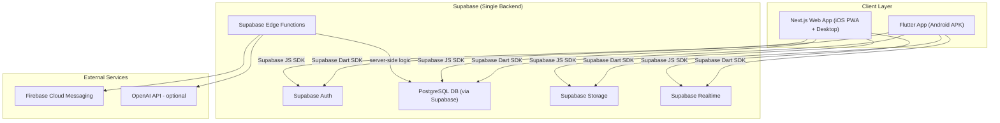

# RoadMap — Kingdom Quest

> **Kingdom Quest** — A Multi-Church Youth Ministry Platform · Flutter Mobile (Android) + Next.js Web App (iOS PWA & Desktop)

---

## 1. Brand Design System

### Colors — Light Mode
- **Terracotta (Primary)**: `#B8614A`
- **Burnt Amber (Accent)**: `#C7784E`
- **Olive Clay (Secondary)**: `#7E7458`
- **Umber (Text Primary)**: `#1C1410`
- **Sand (Background)**: `#F3ECE0`
- **Linen (Cards/Surfaces)**: `#F8F3EB`
- **Muted (Captions)**: `#5E5346`
- **Sage (Success)**: `#4A7D57`
- **Alert (Destructive)**: `#CC3D28`

### Colors — Dark Mode (“Warm Twilight”)
- **Umber Night (Scaffold)**: `#0F0B09`
- **Espresso (Cards/Surfaces)**: `#1A1310`
- **Plum Dusk (Raised Surfaces)**: `#261D18`
- **Glow (Highlight)**: `#F5D984`
- **Text on Dark**:
  - Primary: `#F7F0E6`
  - Secondary: `#C3B4A5`
  - Muted: `#8A7C6E`
  - Accent Link: `#E0946A`

### Typography
- **Display**: Bricolage Grotesque (400 / 500 / 600 / 700)
- **Body**: Schibsted Grotesk (400 / 500 / 600)
- **H1**: 72px / weight 700 · Bricolage
- **H2**: 36px / weight 600 · Bricolage
- **Body**: 16px / line-height 1.6 · Schibsted Grotesk
- **Caption**: 14px · mono · uppercase

### Spacing & Sizing
- **Base Grid**: 4px
- **Scale**: 4 · 8 · 12 · 16 · 20 · 24 · 32 · 48 · 64
- **Border Radii**: 12px (chips/buttons) · 16px (cards) · 24px (sections) · full (pills/toggles)

---

## 2. Delivery Strategy

> [!IMPORTANT]
> **Why both a Flutter app AND a web app?**  
> iOS App Store distribution requires an Apple Developer membership ($99/yr). As an alternative for iOS users, the Next.js web app (installable as a PWA on iOS via Safari “Add to Home Screen”) provides the same feature set without the App Store barrier. Both surfaces share the exact same Supabase backend — same database, same auth, same storage, same realtime.

---

## 3. Unified Architecture



---

## 4. Navigation Resilience & Android Lifecycle Safety

> [!NOTE]
> **Preventing Sudden App Closures on Back Navigation**  
> Resolved Android hardware back button and edge-swipe gesture issues where navigating backward unexpectedly terminated the app.

- **`AppPopScope` & `AppBackButton`**:
  - Intercepts Android hardware/gesture back events.
  - If `context.canPop()` is true, pops the route normally.
  - If `context.canPop()` is false (stack cleared or direct deep link), safely navigates to `fallbackRoute` (`/home` or `/admin`) instead of closing.
- **Tab History Tracking**:
  - `MainShell` and `AdminShell` track bottom navigation history stack (`_tabHistory`).
  - Pressing back reverses through visited tabs (e.g. Home → Community → Events → Profile).
- **Double-Tap to Exit Protection**:
  - When at the root tab with no remaining history, pressing back displays: *"Press back again to exit Kingdom Quest"*.
  - A second press within 2 seconds cleanly exits via `SystemNavigator.pop()`.
- **Stack-Preserving Routing**:
  - Replaced stack-wiping `context.go()` calls on nested child screens with `context.push()`.

---

## 5. High-Impact Spiritual Growth Features

### A. Offline Canonical Bible Reader
- **Route**: `/bible`
- **Files**: `lib/features/bible/presentation/bible_reader_screen.dart`, `lib/shared/services/bible_service.dart`
- **Capabilities**:
  - Complete index of all 66 canonical Bible books (39 OT, 27 NT) organized by category (Law, History, Poetry, Prophets, Gospels, Epistles, Prophecy).
  - Quick modal picker for testament, book, and chapter.
  - Full curated scripture texts (John 1, 3, 14; Romans 8, 12; 1 Cor 13; Phil 4; Psalms 23, 91, 121; Prov 3; Gen 1; Matt 5, 6; Eph 6; James 1) + dynamic devotional passage generator.
  - Interactive verse modal: copy scripture, link verse into personal sermon journal, explore reading plans.
  - Dynamic font size scaler (15pt, 17pt, 20pt, 24pt).
  - Instant scripture search across biblical passages.

### B. Curated Youth Reading Plans
- **Route**: `/reading-plans`
- **Files**: `lib/features/bible/presentation/reading_plans_screen.dart`, `lib/shared/models/bible_models.dart`
- **Capabilities**:
  - 3 youth-centric plans:
    1. *Overcoming Anxiety & Finding Peace* (7 Days)
    2. *Discovering Your Purpose & Identity* (14 Days)
    3. *Wisdom for Decisions (Proverbs)* (7 Days)
  - Interactive day checklist with reflection devotion and guided prayer prompt.
  - Direct "Read" button opening scripture in the Bible Reader.
  - Offline completion persistence via `SharedPreferences`.

### C. Personal Sermon Notes & Devotional Journal
- **Route**: `/notes`
- **Files**: `lib/features/notes/presentation/personal_notes_screen.dart`, `lib/shared/models/personal_note.dart`
- **Capabilities**:
  - Create, edit, and search personal reflections, linked sermon titles, and tagged scripture references.
  - 5 soft pastel color themes for organizing notes.
  - Full-text search across titles, sermon themes, content, and scriptures.

### D. Testimony & Answered Prayers Wall
- **Route**: `/testimonies`
- **Files**: `lib/features/testimonies/presentation/testimony_wall_screen.dart`, `lib/shared/models/testimony.dart`
- **Capabilities**:
  - Public praise wall celebrating answered prayers and God's faithfulness.
  - Category filters: *Healing, Provision, Academics, Faith, Family, Deliverance*.
  - Interactive reactions: "🙌 Amen!" | "🔥 Praise God!" | "❤️ Love".
  - Anonymous testimony submission toggle.
  - Cross-link banner directly embedded in `PrayerRequestsScreen`.

---

## 6. Gamification & Youth Engagement Engine

### A. Daily Quests & Flame Streak Tracker
- **Route**: `/quests`
- **Files**: `lib/features/gamification/presentation/quests_and_badges_screen.dart`, `lib/shared/services/gamification_service.dart`
- **Capabilities**:
  - "🔥" Fire streak tracker with personal best record and total XP score.
  - Daily spiritual quests reset daily:
    -  Read Scripture in Bible Reader (+10 XP)
    -  Write Devotional or Sermon Reflection (+15 XP)
    -  Lift Up a Brother or Sister on Prayer Wall (+10 XP)
  - Interactive checklist that updates state and persists progress locally.

### B. Milestone Badges System
- **Files**: `lib/shared/models/gamification_models.dart`, `lib/shared/services/gamification_service.dart`
- **Capabilities**:
  - 8 unlockable badges with progress tracking and unlock modals:
    1. 🌱 *First Steps* — Begin spiritual journey
    2. 🛡️ *Shield of Faith* — Pray for a member or submit a prayer
    3. 🔥 *Fervent in Spirit* — Reach a 3-day continuous streak
    4. 📖 *Berean Mindset* — Read 5 chapters in Bible Reader or journal
    5. 🙌 *Living Testimony* — Share or react to a testimony
    6. 💡 *Wisdom Seeker* — Complete any youth reading plan
    7. ⚔️ *Prayer Warrior* — Pray for 10 prayer requests on the wall
    8. 👑 *Bible Scholar* — Score 100% on any weekly Bible Trivia quiz

### C. Weekly Bible Trivia Challenge
- **Route**: `/trivia`
- **Files**: `lib/features/gamification/presentation/trivia_quiz_screen.dart`
- **Capabilities**:
  - 15-second countdown timer with animated visual progress bar.
  - 2 built-in quizzes: *Heroes of Faith Challenge* and *Parables & Kingdom Secrets*.
  - Instant answer validation (green for correct, red for incorrect).
  - Scripture explanation cards citing biblical references.
  - End-of-quiz score card with percentage, XP rewards (+15 XP per correct answer), and badge unlocks.

---

## 7. Updated Flutter Project Structure

```
kingdom_quest/                          ← Flutter Mobile App
├── lib/
│   ├── main.dart
│   ├── core/
│   │   ├── theme/                      ← AppColors, AppSpacing, Theme tokens
│   │   ├── providers/                  ← AppProviders, FeatureProviders (Riverpod)
│   │   ├── router/                     ← GoRouter with /bible, /notes, /quests, etc.
│   │   └── supabase/                   ← Supabase client init
│   ├── features/
│   │   ├── auth/                       ← Login, Register, Splash
│   │   ├── dashboard/                  ← MainShell, HomeScreen with Streak Banner
│   │   ├── bible/                      ← BibleReaderScreen, ReadingPlansScreen
│   │   ├── notes/                      ← PersonalNotesScreen
│   │   ├── testimonies/                ← TestimonyWallScreen
│   │   ├── gamification/               ← QuestsAndBadgesScreen, TriviaQuizScreen
│   │   ├── prayer_requests/            ← PrayerRequestsScreen, SubmitPrayerScreen
│   │   ├── petitions/                  ← PetitionsScreen, SubmitPetitionScreen
│   │   ├── advice/                     ← AdviceScreen, SubmitAdviceScreen
│   │   ├── daily_inspiration/          ← InspirationScreen
│   │   ├── community_forum/            ← ForumScreen, CreatePostScreen
│   │   ├── feed/                       ← ChurchFeedScreen (Sunday moments)
│   │   ├── events/                     ← EventsScreen
│   │   ├── notifications/              ← NotificationsScreen
│   │   ├── profile/                    ← ProfileScreen
│   │   ├── settings/                   ← SettingsScreen
│   │   └── admin/                      ← AdminShell, Admin Home & sub-modules
│   └── shared/
│       ├── widgets/                    ← AppPopScope, AppBackButton
│       ├── models/                     ← Bible, Gamification, Testimony, Notes
│       └── services/                   ← BibleService, GamificationService, MockData
├── test/
│   ├── services/                       ← Unit tests for Bible & Gamification services
│   └── widgets/                        ← AppPopScope back-navigation tests
└── pubspec.yaml
```

---

## 8. Database Schema & Storage Updates

### A. Core Supabase Tables
- `users` — Supabase Auth `auth.users`
- `profiles` — `user_id`, `display_name`, `avatar_url`, `bio`, `gender`, `role`, `church_id`
- `churches` — `id`, `name`, `logo_url`, `theme_color`
- `prayer_requests` & `prayer_responses`
- `petitions` & `advice_requests` / `advice_responses`
- `inspirations`, `inspiration_reactions`, `inspiration_comments`
- `forum_posts`, `forum_comments`, `forum_votes`, `forum_reports` (anonymized via SHA-256 tokens)
- `events` & `event_registrations`
- `church_feed_posts` (meeting moments & Sunday photos)
- `notifications` & `fcm_tokens`

### B. New Tables & Local Persistence
- **`testimonies`**:
  - `id`, `title`, `story`, `author_name`, `is_anonymous`, `category`, `amen_count`, `praise_count`, `heart_count`, `created_at`
- **`personal_notes`**:
  - `id`, `user_id`, `title`, `content`, `scripture_references` (text[]), `linked_sermon_title`, `color_index`, `created_at`, `updated_at`
- **`user_streaks`** (Cached locally + synced):
  - `user_id`, `current_streak`, `longest_streak`, `last_active_date`, `xp_points`, `daily_task_flags`
- **`milestone_badges`**:
  - `user_id`, `badge_id`, `progress`, `target`, `is_unlocked`, `unlocked_at`
- **`reading_plan_progress`**:
  - `user_id`, `plan_id`, `completed_day_numbers` (int[])

---

## 9. Feature Implementation Status

| Feature Module | Mobile (Flutter) | Web (Next.js) | Backend / Storage | Status |
| :--- | :---: | :---: | :---: | :---: |
| **Auth & Profiles** | ✅ | ✅ | Supabase Auth + RLS | Done |
| **Back Button App Exit Fix** | ✅ | N/A | `AppPopScope` & `_tabHistory` | Done |
| **Prayer Requests & Wall** | ✅ | ✅ | Supabase DB | Done |
| **Petitions & Advice** | ✅ | ✅ | Supabase DB | Done |
| **Anonymous Community Forum**| ✅ | ✅ | Hashed Token Privacy | Done |
| **Sunday Moments Feed** | ✅ | ✅ | Supabase Storage + Feed | Done |
| **Offline Bible Reader (66 Books)** | ✅ | Pending | Embedded + Local | Done |
| **Curated Youth Reading Plans** | ✅ | Pending | SharedPreferences | Done |
| **Devotional Journal & Notes** | ✅ | Pending | Local + SharedPreferences | Done |
| **Answered Prayers & Testimonies** | ✅ | Pending | Mock + DB Ready | Done |
| **Daily Quests & Streak System** | ✅ | Pending | SharedPreferences + Notifier | Done |
| **Milestone Badges (8 Badges)** | ✅ | Pending | Gamification Engine | Done |
| **Weekly Bible Trivia Challenge** | ✅ | Pending | Timed Quiz Engine | Done |
