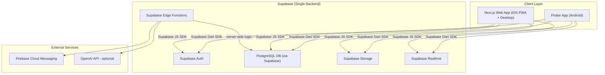

# Kingdom Quest — Implementation Plan

> A Multi-Church Youth Ministry Platform · Flutter Mobile + Next.js Web App

---

## 1. Brand Design System (Extracted from Guidelines)

### Colors — Light Mode
| Token | Hex | Usage |
|-------|-----|-------|
| Terracotta | `#B8614A` | Primary · CTAs |
| Burnt Amber | `#C7784E` | Accent · gradients |
| Olive Clay | `#7E7458` | Secondary |
| Umber | `#2C211A` | Text · ink |
| Sand | `#F1E9DC` | Background |
| Linen | `#F8F1E8` | Cards |
| Muted | `#706750` | Captions |
| Sage | `#5B8A68` | Success |
| Alert | `#E24E36` | Care · flag |

### Colors — Dark Mode ("Warm Twilight")
| Token | Hex | Usage |
|-------|-----|-------|
| Umber Night | `#1A110E` | Base |
| Espresso | `#241A15` | Surface |
| Plum Dusk | `#332420` | Raised · twilight |
| Burnt Amber | `#C7784E` | Accent · reused |
| Glow | `#F5D984` | Highlight · reused |

#### Text on Dark
- Primary: `#F7F0E6`
- Secondary: `#C3B4A5`
- Muted: `#8A7C6E`
- Accent link: `#E0946A`

### Typography
- **Display**: Bricolage Grotesque (400/500/600/700)
- **Body**: Schibsted Grotesk (400/500/600)
- H1: 72px / weight 700 · Bricolage
- H2: 36px / weight 600 · Bricolage
- Body: 16px / line-height 1.6 · Schibsted Grotesk
- Caption: 14px · mono · uppercase

### Spacing & Sizing
- 4px base grid
- Steps: 4 · 8 · 12 · 16 · 20 · 24 · 32 · 48 · 64
- Radii: 12px (chips/buttons) · 16px (cards) · 24px (sections) · full (pills/toggles)

### The Mark
- Vessel cupping an offering — abstract, name-independent
- Warm fills on dark surfaces with faint amber glow
- App icon: mark on terracotta→burnt-amber gradient at ~58% width

---

## 2. Delivery Strategy

> [!IMPORTANT]
> **Why both a Flutter app AND a web app?**
> iOS App Store distribution requires Apple Developer membership ($99/yr). As an alternative for iOS users, the **Next.js web app** (installable as a PWA on iOS via Safari "Add to Home Screen") provides the same feature set without the App Store requirement.
>
> Both surfaces share the **exact same Supabase project** — same database, same auth, same storage, same realtime. No data duplication, no syncing required.

| Surface | Tech | Who Uses It |
|---------|------|-------------|
| Mobile App | Flutter (Android native) | Android users & future iOS if enrolled in Apple Dev |
| Web App (PWA) | Next.js + TypeScript | iOS users (Safari PWA) + desktop browsers |
| Admin Panel | Built into Next.js web app (admin role) | Church admins & pastors |

---

## 3. Unified Architecture



> [!NOTE]
> There is **no separate NestJS API server**. Supabase replaces it entirely:
> - **Auth** → Supabase Auth (email/password, Google OAuth, magic links)
> - **Database** → PostgreSQL built into Supabase (no separate Postgres install)
> - **API** → Supabase auto-generates REST + GraphQL APIs from your schema, with Row-Level Security enforcing access
> - **Real-time** → Supabase Realtime (WebSocket subscriptions)
> - **Storage** → Supabase Storage (avatars, media)
> - **Server logic** → Supabase Edge Functions (Deno/TypeScript, for FCM push, moderation, etc.)

---

## 4. Tech Stack

| Layer | Technology | Notes |
|-------|------------|-------|
| Mobile App | Flutter 3.x + Dart | Android (primary), future iOS |
| Web App | Next.js 14 + TypeScript | iOS PWA + desktop + admin panel |
| State Management (Mobile) | Riverpod 3.x | `NotifierProvider` pattern |
| State Management (Web) | Zustand or React Context | Lightweight, server-component friendly |
| Navigation (Mobile) | GoRouter | |
| Navigation (Web) | Next.js App Router | |
| Backend / Database | **Supabase** | Auth + PostgreSQL + Storage + Realtime + Edge Functions |
| Supabase SDK (Mobile) | `supabase_flutter` Dart package | |
| Supabase SDK (Web) | `@supabase/supabase-js` | |
| Push Notifications | Firebase Cloud Messaging | Triggered via Supabase Edge Functions |
| Styling (Web) | Tailwind CSS | Matches brand tokens |
| Hosting (Web) | Vercel | Next.js native deployment |
| Real-time | Supabase Realtime | WebSocket channels |
| Media Storage | Supabase Storage | Avatars, inspiration images |

---

## 5. Flutter Project Structure

```
kingdom_quest/                          ← Flutter Mobile App
├── lib/
│   ├── main.dart
│   ├── core/
│   │   ├── theme/                      ← Design system
│   │   ├── providers/                  ← Riverpod providers
│   │   ├── router/                     ← GoRouter
│   │   └── supabase/                   ← Supabase client init
│   ├── features/
│   │   ├── auth/
│   │   ├── dashboard/
│   │   ├── prayer_requests/
│   │   ├── petitions/
│   │   ├── advice/
│   │   ├── daily_inspiration/
│   │   ├── community_forum/
│   │   ├── events/
│   │   ├── notifications/
│   │   ├── profile/
│   │   ├── settings/
│   │   └── admin/
│   └── shared/
│       ├── widgets/
│       ├── models/                     ← Shared with web via same Supabase schema
│       └── services/
├── assets/
└── pubspec.yaml
```

---

## 6. Next.js Web App Structure

```
kingdom-quest-web/                      ← Next.js Web App (separate repo or monorepo)
├── app/
│   ├── (auth)/
│   │   ├── login/
│   │   └── register/
│   ├── (main)/
│   │   ├── home/
│   │   ├── prayer-requests/
│   │   ├── petitions/
│   │   ├── advice/
│   │   ├── inspiration/
│   │   ├── forum/
│   │   ├── events/
│   │   ├── notifications/
│   │   └── profile/
│   └── (admin)/
│       ├── dashboard/
│       ├── users/
│       ├── content/
│       └── analytics/
├── components/
│   ├── ui/                             ← Shared design system components
│   └── features/
├── lib/
│   ├── supabase/                       ← Supabase client (browser + server)
│   └── types/                          ← TypeScript types (mirrors Dart models)
├── public/
│   └── manifest.json                   ← PWA manifest
└── next.config.ts
```

---

## 7. Supabase Database Schema (shared by both apps)

### Core Tables
- `users` (Supabase Auth `auth.users` extended via trigger)
- `profiles` — user_id FK, display_name, avatar_url, bio, gender, role (`member`/`admin`), church_id, created_at
- `churches` — id, name, logo_url, theme_color, created_at

### Prayer Requests
- `prayer_requests` — id, user_id FK (nullable for anon), church_id, title, description, category, is_anonymous, display_name, status, prayer_count, created_at
- `prayer_responses` — id, prayer_request_id FK, admin_id FK, message, created_at

### Petitions
- `petitions` — id, user_id FK (nullable), church_id, subject, description, is_anonymous, display_name, status (`pending`/`under_review`/`resolved`), created_at, updated_at

### Advice
- `advice_requests` — id, user_id FK (nullable), church_id, title, description, is_anonymous, display_name, status, created_at
- `advice_responses` — id, advice_request_id FK, admin_id FK, message, bible_references (text[]), created_at

### Daily Inspiration
- `inspirations` — id, admin_id FK, church_id, title, content, type, bible_reference, media_url, scheduled_at, published_at, like_count, comment_count, created_at
- `inspiration_reactions` — id, inspiration_id FK, user_id FK, reaction_type, created_at
- `inspiration_comments` — id, inspiration_id FK, user_id FK, content, created_at

### Community Forum (Privacy-Preserving)
- `forum_posts` — id, anonymous_token (hashed SHA-256), church_id, title, content, display_name, vote_score, like_count, comment_count, created_at
- `forum_comments` — id, post_id FK, anonymous_token, content, display_name, created_at
- `forum_votes` — id, post_id FK, anonymous_token, vote_type
- `forum_reports` — id, post_id FK, comment_id FK (nullable), reason, reporter_token, created_at

> [!IMPORTANT]
> Anonymous forum posts use a one-way hashed token derived from user_id + salt. Admins CANNOT reverse-lookup identities. Moderation is content-based only.

### Events & Announcements
- `events` — id, church_id, title, description, location, start_time, end_time, is_recurring, recurring_pattern, created_by FK, registration_count, created_at
- `event_registrations` — id, event_id FK, user_id FK, created_at
- `announcements` — id, church_id, admin_id FK, title, content, media_urls (text[]), is_pinned, created_at

### Notifications
- `notifications` — id, user_id FK, type, title, body, data (jsonb), is_read, created_at
- `fcm_tokens` — id, user_id FK, token, platform (`android`/`ios`/`web`), created_at

---

## 8. Row-Level Security (RLS) Strategy

| Table | Read | Insert | Update | Delete |
|-------|------|--------|--------|--------|
| `profiles` | own row | own row | own row | ✗ |
| `prayer_requests` | church members | authenticated | ✗ | own row |
| `petitions` | church members | authenticated | ✗ | own row |
| `inspirations` | church members | admin only | admin only | admin only |
| `forum_posts` | church members | authenticated | ✗ | admin only |
| `events` | church members | admin only | admin only | admin only |
| `notifications` | own rows | Edge Fn only | own row | own row |
| `churches` | authenticated | ✗ | admin only | ✗ |

---

## 9. Phased Delivery Roadmap

### Phase 1 — Foundation ✅
- [x] Create implementation plan
- [x] Scaffold Flutter project
- [x] Implement design system (colors, typography, spacing, theme)
- [x] Splash screen with brand animation
- [x] Auth screens (login, register)
- [x] Home dashboard with verse of the day, quick actions
- [x] Bottom navigation shell
- [x] Wire up main.dart (ProviderScope, GoRouter, ThemeMode)
- [x] Migrate providers to Riverpod 3 (NotifierProvider)
- [x] Profile screen (avatar, stats, activity feed)
- [x] Settings screen (theme switcher, notifications, account, sign-out)

### Phase 2 — Core Modules ✅
- [x] Prayer request submission & listing
- [x] Petition submission & tracking
- [x] Advice center
- [x] Daily inspiration feed

### Phase 3 — Community & Events ✅
- [x] Anonymous community forum
- [x] Church announcements (Announcements tab in Events screen)
- [x] Events calendar (Events tab with registration toggle)
- [x] Notification center (mark-read, type-specific icons)

### Phase 4 — Admin Dashboard (Flutter)
- [ ] Admin home with stats overview
- [ ] Prayer request management (view, respond, mark answered)
- [ ] Petition management (view, update status, respond)
- [ ] Advice center moderation (respond, close)
- [ ] Inspiration publisher (create, schedule, publish)
- [ ] Forum moderation (view reports, remove posts)
- [ ] User management (view members, assign roles)

### Phase 5 — Supabase Backend Integration
- [ ] Supabase project setup & environment config
- [ ] Apply full database schema + RLS policies
- [ ] Supabase Auth integration (Flutter: `supabase_flutter`)
- [ ] Replace all mock data with Supabase queries (Flutter)
- [ ] Supabase Realtime subscriptions (forum, notifications)
- [ ] Supabase Storage (avatar upload, inspiration images)
- [ ] Edge Functions: push notification dispatch (FCM), anonymous token hashing

### Phase 6 — Next.js Web App (iOS PWA + Admin Panel)
- [ ] Scaffold Next.js 14 project with TypeScript + Tailwind
- [ ] Supabase JS SDK integration (browser + server components)
- [ ] PWA setup (manifest, service worker, install prompt)
- [ ] Shared design tokens (match Flutter brand colors)
- [ ] Auth pages (login, register, OAuth)
- [ ] All member-facing feature pages (mirrors Flutter screens)
- [ ] Admin panel (built-in, role-gated)
- [ ] Deploy to Vercel

### Phase 7 — Cross-Platform Polish & Deployment
- [ ] Firebase Cloud Messaging (mobile + web push)
- [ ] End-to-end testing (Flutter integration tests, Playwright for web)
- [ ] App icon, splash assets, PWA icon set
- [ ] Android Play Store build & submission

---

## 10. Security Architecture

- **Auth**: Supabase Auth — email/password, Google OAuth, magic link → JWT
- **RLS**: PostgreSQL Row-Level Security on ALL tables — no data leaks possible
- **Anonymity**: One-way SHA-256 hash for forum tokens; salt rotated monthly
- **Edge Functions**: Only server-side code can write to `notifications` and `fcm_tokens`
- **Encryption**: TLS in transit (Supabase handles this); `pgcrypto` for sensitive fields
- **Rate Limiting**: Supabase built-in + Vercel edge middleware for web
- **Content Filtering**: Manual admin review queue + optional OpenAI moderation API

---

## 11. Key Screens — Both Platforms

| # | Screen | Flutter (Mobile) | Next.js (Web/PWA) |
|---|--------|-----------------|-------------------|
| 1 | Splash | ✅ Done | Loading state on root |
| 2 | Login / Register | ✅ Done | ⏳ To build |
| 3 | Home Dashboard | ✅ Done | ⏳ To build |
| 4 | Prayer Requests | ✅ Done | ⏳ To build |
| 5 | Petitions | ✅ Done | ⏳ To build |
| 6 | Advice Center | ✅ Done | ⏳ To build |
| 7 | Daily Inspiration | ✅ Done | ⏳ To build |
| 8 | Community Forum | ✅ Done | ⏳ To build |
| 9 | Events & Announcements | ✅ Done | ⏳ To build |
| 10 | Notifications | ✅ Done | ⏳ To build |
| 11 | User Profile | ✅ Done | ⏳ To build |
| 12 | Settings | ✅ Done | ⏳ To build |
| 13 | Admin Dashboard | ⏳ To build | ⏳ To build (primary) |
