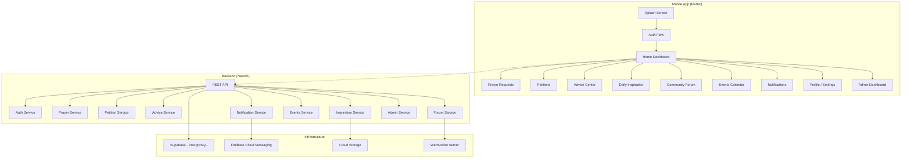

# Kingdom Quest — Implementation Plan

> A Multi-Church Youth Ministry Mobile Application

## 1. Brand Design System (Extracted from Guidelines)

### Colors — Light Mode
| Token | Hex | Usage |
|-------|-----|-------|
| Terracotta | `#B8614A` | Primary · CTAs |
| Burnt Amber | `#C7784E` | Accent · gradients |
| Olive Clay | `#7E7458` | Secondary |
| Umber | `#2C211A` | Text · ink |
| Sand | `#F1E9DC` | Background |
| Linen | `#F8F1E8` | Cards |
| Muted | `#706750` | Captions |
| Sage | `#5B8A68` | Success |
| Alert | `#E24E36` | Care · flag |

### Colors — Dark Mode ("Warm Twilight")
| Token | Hex | Usage |
|-------|-----|-------|
| Umber Night | `#1A110E` | Base |
| Espresso | `#241A15` | Surface |
| Plum Dusk | `#332420` | Raised · twilight |
| Burnt Amber | `#C7784E` | Accent · reused |
| Glow | `#F5D984` | Highlight · reused |

#### Text on Dark
- Primary: `#F7F0E6`
- Secondary: `#C3B4A5`
- Muted: `#8A7C6E`
- Accent link: `#E0946A`

### Typography
- **Display**: Bricolage Grotesque (400/500/600/700)
- **Body**: Schibsted Grotesk (400/500/600)
- H1: 72px / weight 700 · Bricolage
- H2: 36px / weight 600 · Bricolage
- Body: 16px / line-height 1.6 · Schibsted Grotesk
- Caption: 14px · mono · uppercase

### Spacing & Sizing
- 4px base grid
- Steps: 4 · 8 · 12 · 16 · 20 · 24 · 32 · 48 · 64
- Radii: 12px (chips/buttons) · 16px (cards) · 24px (sections) · full (pills/toggles)

### The Mark
- Vessel cupping an offering — abstract, name-independent
- Warm fills on dark surfaces with faint amber glow
- App icon: mark on terracotta→burnt-amber gradient at ~58% width

---

## 2. Architecture Overview



---

## 3. Tech Stack

| Layer | Technology |
|-------|-----------|
| Mobile Frontend | Flutter 3.x + Dart |
| State Management | Riverpod 2.x |
| Navigation | GoRouter |
| Backend | NestJS (TypeScript) |
| Admin Panel | Nuxt 3 (Vue.js) |
| Database | Supabase (PostgreSQL + Row-Level Security) |
| Auth | Supabase Auth + JWT |
| Push Notifications | Firebase Cloud Messaging |
| Real-time | Supabase Realtime (WebSockets) |
| Media Storage | Supabase Storage |
| AI Scripture | OpenAI API |

---

## 4. Flutter Project Structure

```
kingdom_quest/
├── lib/
│   ├── main.dart
│   ├── app.dart
│   ├── core/
│   │   ├── theme/
│   │   │   ├── app_colors.dart
│   │   │   ├── app_typography.dart
│   │   │   ├── app_theme.dart
│   │   │   └── app_spacing.dart
│   │   ├── constants/
│   │   ├── utils/
│   │   ├── extensions/
│   │   └── router/
│   │       └── app_router.dart
│   ├── features/
│   │   ├── auth/
│   │   │   ├── data/
│   │   │   ├── domain/
│   │   │   └── presentation/
│   │   ├── dashboard/
│   │   ├── prayer_requests/
│   │   ├── petitions/
│   │   ├── advice/
│   │   ├── daily_inspiration/
│   │   ├── community_forum/
│   │   ├── events/
│   │   ├── notifications/
│   │   ├── profile/
│   │   ├── settings/
│   │   └── admin/
│   ├── shared/
│   │   ├── widgets/
│   │   ├── models/
│   │   └── services/
│   └── l10n/
├── assets/
│   ├── fonts/
│   ├── images/
│   └── icons/
├── test/
└── pubspec.yaml
```

---

## 5. Database Schema (PostgreSQL via Supabase)

### Core Tables
- `users` — id, email, phone, display_name, avatar_url, role, church_id, created_at
- `churches` — id, name, logo_url, theme_config, created_at
- `profiles` — user_id FK, bio, gender, date_of_birth, preferences

### Prayer Requests
- `prayer_requests` — id, user_id FK (nullable for anon), church_id, title, description, category, is_anonymous, status, created_at
- `prayer_responses` — id, prayer_request_id FK, admin_id FK, message, created_at

### Petitions
- `petitions` — id, user_id FK (nullable), church_id, subject, description, is_anonymous, status (pending/under_review/resolved), created_at

### Advice
- `advice_requests` — id, user_id FK (nullable), church_id, title, description, is_anonymous, status, created_at
- `advice_responses` — id, advice_request_id FK, admin_id FK, message, bible_references, created_at

### Daily Inspiration
- `inspirations` — id, admin_id FK, church_id, title, content, type (motivation/devotional/verse/challenge), media_urls, scheduled_at, published_at
- `inspiration_reactions` — id, inspiration_id FK, user_id FK, reaction_type
- `inspiration_comments` — id, inspiration_id FK, user_id FK, content, created_at

### Community Forum (Privacy-Preserving)
- `forum_posts` — id, anonymous_token (hashed), church_id, title, content, display_name (Anonymous Member/Sister/Brother), created_at
- `forum_comments` — id, post_id FK, anonymous_token, content, display_name, created_at
- `forum_votes` — id, post_id FK, anonymous_token, vote_type
- `forum_reports` — id, post_id FK, comment_id FK (nullable), reason, reporter_token, created_at

> [!IMPORTANT]
> Anonymous forum posts use a one-way hashed token derived from user_id + salt. Admins CANNOT reverse-lookup identities. Moderation is content-based only.

### Events
- `events` — id, church_id, title, description, location, start_time, end_time, recurring, created_by FK
- `event_registrations` — id, event_id FK, user_id FK, created_at

### Announcements
- `announcements` — id, church_id, admin_id FK, title, content, media_urls, priority, created_at

### Notifications
- `notifications` — id, user_id FK, type, title, body, data_payload, read, created_at
- `fcm_tokens` — id, user_id FK, token, platform, created_at

---

## 6. Phased Delivery Roadmap

### Phase 1 — Foundation (Current Session)
- [x] Create implementation plan
- [ ] Scaffold Flutter project
- [ ] Implement design system (colors, typography, spacing, theme)
- [ ] Splash screen with brand animation
- [ ] Auth screens (login, register, forgot password)
- [ ] Home dashboard with verse of the day, quick actions
- [ ] Bottom navigation shell
- [ ] Profile & settings screens

### Phase 2 — Core Modules
- [ ] Prayer request submission & listing
- [ ] Petition submission & tracking
- [ ] Advice center
- [ ] Daily inspiration feed

### Phase 3 — Community & Events
- [ ] Anonymous community forum
- [ ] Church announcements
- [ ] Events calendar
- [ ] Notification center

### Phase 4 — Admin & Analytics
- [ ] Admin dashboard
- [ ] User management
- [ ] Content moderation
- [ ] Analytics & metrics

### Phase 5 — Backend & Deployment
- [ ] NestJS API setup
- [ ] Supabase schema & RLS policies
- [ ] Firebase Cloud Messaging integration
- [ ] Nuxt admin panel
- [ ] Deployment configuration

---

## 7. Security Architecture

- **Auth**: Supabase Auth (email/password, Google, phone) → JWT tokens
- **API**: Bearer token validation on every request
- **RLS**: PostgreSQL Row-Level Security on all tables
- **Anonymity**: One-way SHA-256 hash for forum tokens; salt rotated monthly
- **Encryption**: TLS in transit; AES-256 for sensitive fields at rest
- **Rate Limiting**: Per-user API throttling
- **Content Filtering**: AI-based moderation + manual review queue
- **Audit Logs**: All admin actions logged with timestamp and actor

---

## 8. Key Screens (13 total)

1. **Splash Screen** — Brand mark animation on gradient
2. **Login / Register** — Tabbed auth with social sign-in
3. **Home Dashboard** — Greeting, verse, events, quick actions
4. **Prayer Requests** — Submission form + categorized list
5. **Petitions** — Ticket-style submission + status tracker
6. **Advice Center** — Q&A format with admin responses
7. **Daily Inspiration** — Card feed with reactions/comments
8. **Community Forum** — Anonymous discussion threads
9. **Events Calendar** — Calendar view + registration
10. **Notifications** — Push notification history
11. **User Profile** — Avatar, bio, activity stats
12. **Settings** — Theme toggle, language, privacy
13. **Admin Dashboard** — Users, content, analytics panels
